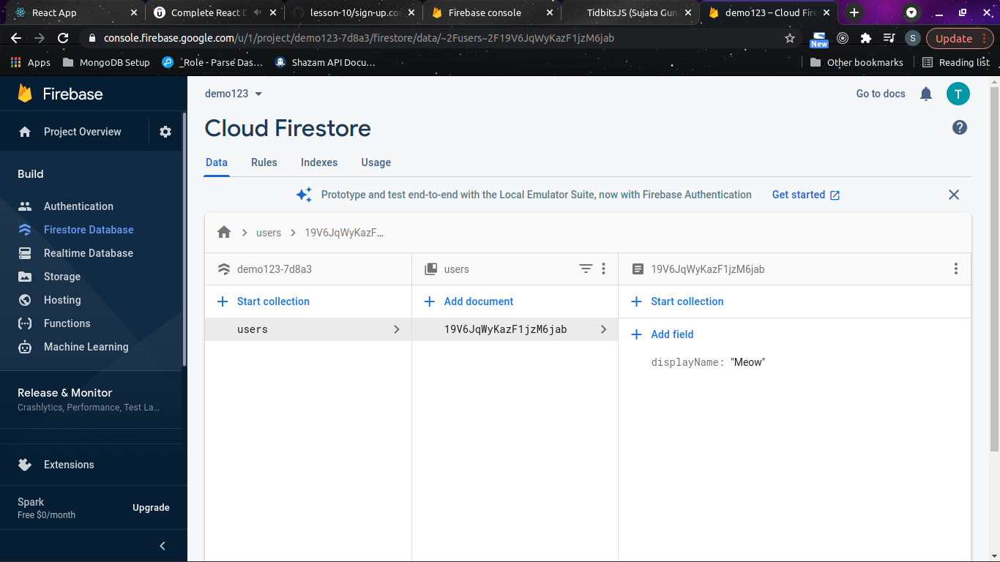

## Firebase - Bazaar Setup

Guidelines for setting up the firebase authentication and database required for the bazaar project. Go through the screenshots below.

1. Open [firebase](https://firebase.google.com/)

Go to the console option. Exactly at the top right corner.

2. Create Project

The window should appear like this. Click on `Add Project` to create a new one. You can see my bazaar project just beside that.

Give your project a meaningful name. I have written `demo123` for the demo.

> Note: It's not necessary to enable google analytics for this project. You can skip that part if you want.

After continue, it should look like this

3. Dashboard

Your project dashboard will look like this. Click on the `</>` button over there. Just below the Get Started by adding Firebase to your app head text.

A modal for app registration will appear. Don't forget to write a meaningful name.

> Note: No need of enabling firebase hosting. Leave it.

After app registration, you will get the firebase configuration for accessing the firebase SDK in your project

> Warning: Don't disclose your configs. Even for the project, make sure to add config details in a separate `.env` file and add the `.env` file path in the `.gitignore` file before pushing the code on GitHub or any other platform.

4. Authentication

Go to the authentication section to enable auth features. Select `Sign-in` Method tab.

For the `Bazaar` project, two types of auths are enabled.

    - Google
    - Through email

Select the edit option for Google. By default, every auth method is disabled.

Enable the Google Sign-in method. Provide the project support email.

Click on the save. & repeat the same procedure for all the types of methods that you want to have.

5. Firestore

For the project, we will be using the `Firestore` and not the `Realtime` database. So choose the proper database section.

Moving forward, click on the create database which will result into

Select the start in test mode so that anyone can write, update or delete data in our database.

Now, enable the firestore location.

The database will be shown, where you can see the data or do something manually. Click on the start collection button. Write `users` as collection id name and then select autoId generation. Add any fields that you want to go under the user's section.

In the end, it should appear like this-

That's it.

You have successfully established a firebase authentication & firestore database. Congrats!

Don't forget to add your config data in the `Bazaar` project as env variables.

With that, you're good to go.

If you face any issues, don't hesitate to create an [issue](https://github.com/TidbitsJS/ZTM-React/issues). We will figure it out together ( with the help of Google ).
